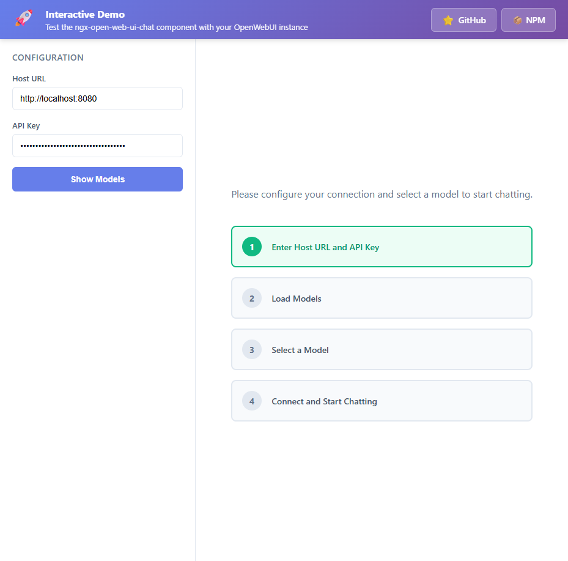
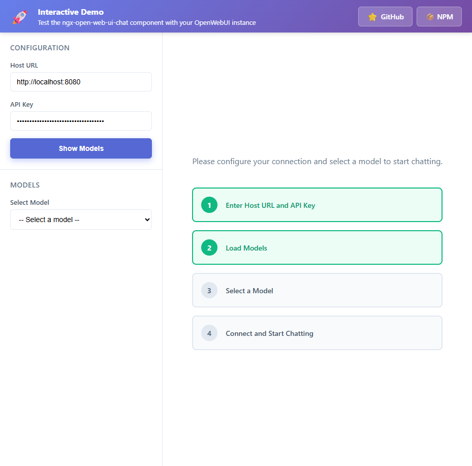
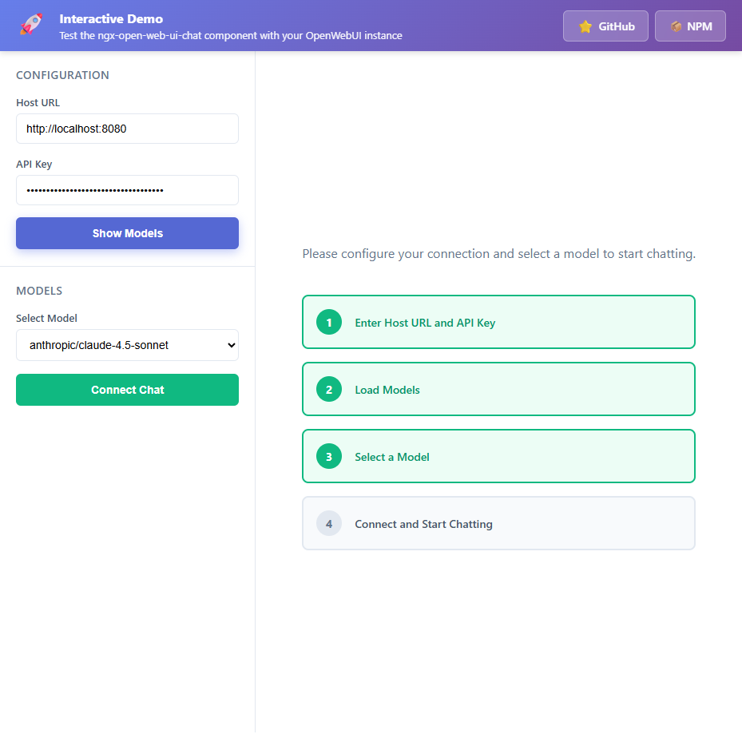
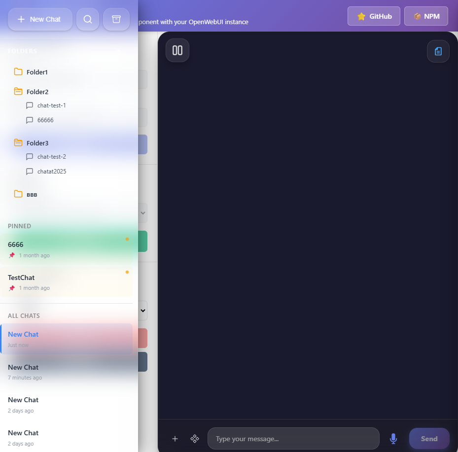
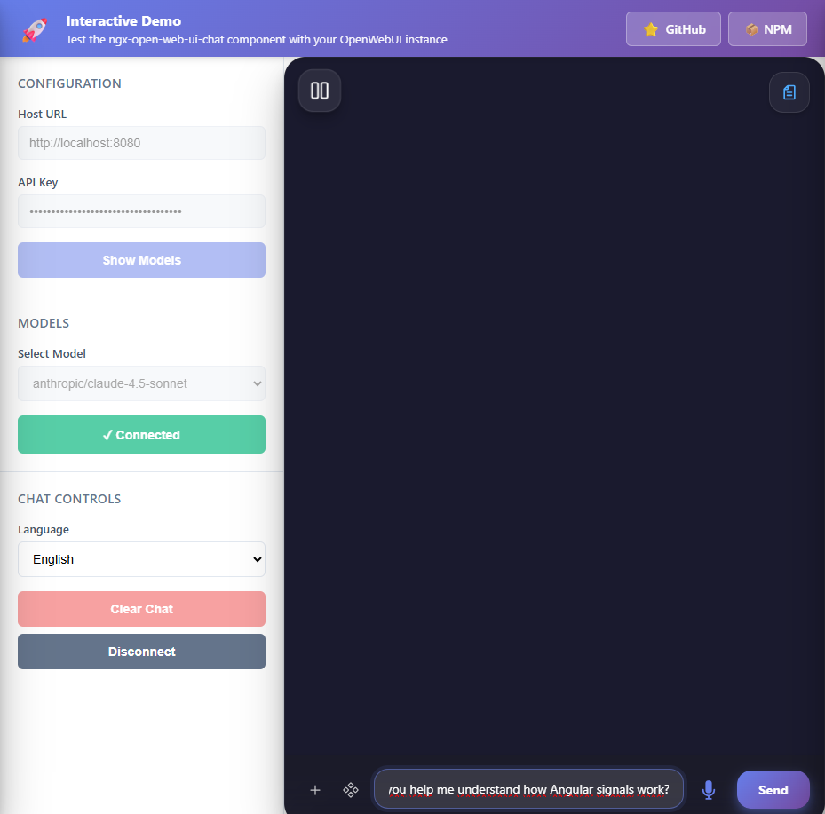
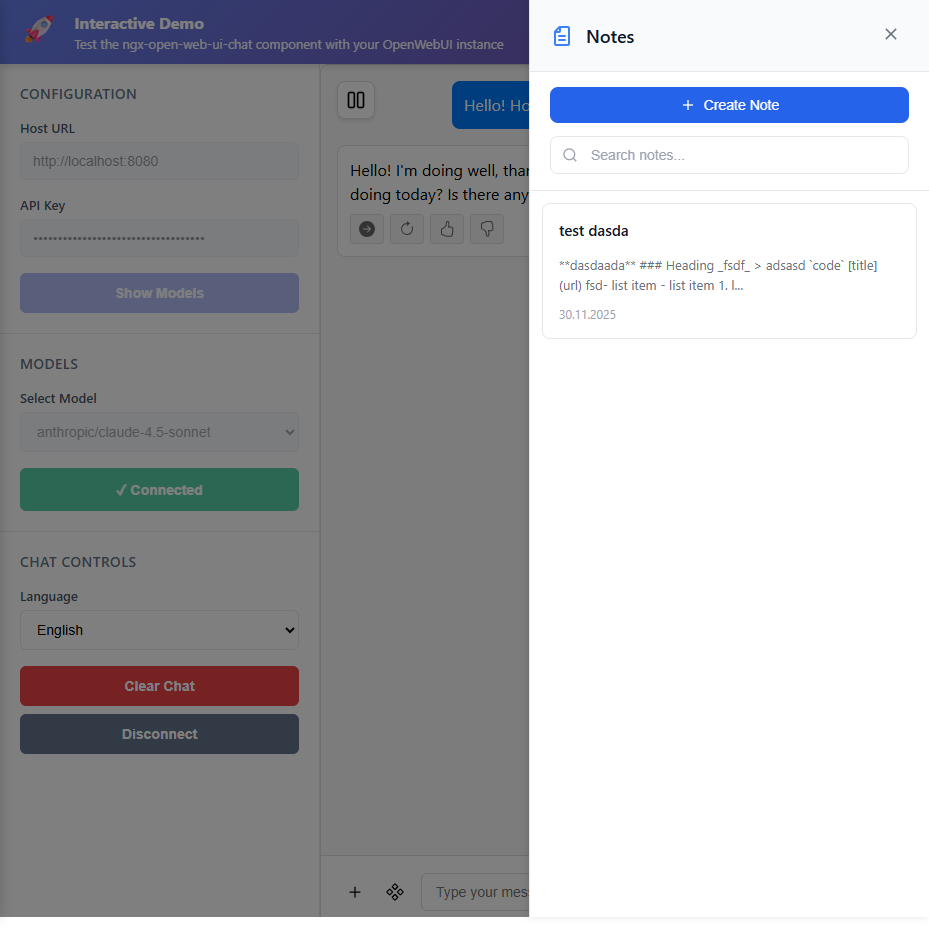

# OpenWebUI TypeScript Embedded SDK

[](./LICENSE)

Modern Angular 20 library for embedding OpenWebUI chat in your applications with full **conversation history**, **markdown support**, and **Angular 2025 architecture**.

## 🌐 Live Demo

**[Try the live demo →](https://micode-ai.github.io/ngx-open-web-ui-chat/)**

Interactive demo showcasing all features:
- Dynamic configuration
- Model selection
- Real-time chat with conversation history
- Markdown rendering
- Multi-language support

## 📖 How to Use the Application

### Quick Start Guide

#### Step 1: Initial Configuration

When you first launch the application, enter your OpenWebUI server details:



**Required:**
1. **Host URL** - Your OpenWebUI server address (e.g., `http://localhost:8080`)
2. **API Key** - Your API authentication key

#### Step 2: Load Available Models

Click **"Show Models"** to fetch the list of AI models from your server:



#### Step 3: Select Your Model

Choose an AI model from the dropdown menu:



#### Step 4: Connect to Chat

Click **"Connect Chat"** to initialize your chat session:



#### Step 5: Start Chatting

Type your message and click **"Send"** or press Enter:




**Features:**
- View all conversations
- Organize chats into folders
- Pin important chats
- Search through history
- Archive old conversations
- Export chats (PDF, TXT, JSON)

#### 📝 Notes Management

Create and manage notes with a built-in markdown editor:



**Features:**
- Rich markdown editor
- Auto-save functionality
- Search through notes
- Reference notes in chats
- Organize with folders

## ✨ Features

- 🚀 **Angular 2025 Ready** - Zoneless, Signals, Modern file structure
- 💬 **Conversation History** - AI remembers all previous messages
- 📝 **Markdown Support** - Rich text rendering with ngx-markdown
- ⚡ **Signals & Zoneless** - Latest Angular reactive patterns
- 📡 **Streaming Responses** - Real-time chat with typing indicator
- ⏹️ **Stop Generation** - Cancel AI response at any time
- 🎤 **Voice Input** - Record audio messages with automatic transcription
- 🌍 **Multi-language** - 10 languages supported
- 🎨 **Customizable** - SCSS with modern features
- 🔧 **TypeScript** - Full type safety
- 📱 **Responsive** - Mobile-friendly design
- ⭐ **Response Actions** - Continue, regenerate, and rate responses
- 👍 **Rating System** - Comprehensive feedback with good/bad ratings
- 📤 **Chat Export** - Download conversations as PDF, TXT, or JSON
- 🛡️ **Safe Deletion** - Prevents accidental deletion of active chats
- 💬 **Ask & Explain** - Context menu for selected text with AI explanations
- 📂 **Folder Support** - Organize chats into folders with drag & drop
- 📝 **Notes Support** - Integrated markdown note editor with sidebar
- 🗃️ **Archived Chats** - View, search, unarchive, and delete archived conversations
- 🔌 **Integrations** - Toggle Web Search and Code Interpreter capabilities
- 🛠️ **Tools Support** - Access and enable server-side tools from Open WebUI API
- 💬 **Reference Chats** - Reference previous conversations in new messages
- 📝 **Reference Notes** - Reference notes in new messages
- 🌐 **Web Page Attachment** - Process and attach web page content to messages
- 🎛️ **Feature Toggles** - Conditional display of advanced features

## 🚀 Quick Start

### Installation

```bash
npm install ngx-open-web-ui-chat
```

### Setup

#### 1. Configure Bootstrap (main.ts)

```typescript
import { bootstrapApplication } from '@angular/platform-browser';
import { provideZonelessChangeDetection } from '@angular/core';
import { provideHttpClient, withInterceptorsFromDi } from '@angular/common/http';
import { provideMarkdown } from 'ngx-markdown';
import { AppComponent } from './app/app.component';

bootstrapApplication(AppComponent, {
  providers: [
    provideZonelessChangeDetection(),  // Zoneless mode!
    provideHttpClient(withInterceptorsFromDi()),
    provideMarkdown()  // For markdown rendering
  ]
}).catch((err) => console.error(err));
```

#### 2. Use Component

```typescript
import { Component } from '@angular/core';
import { OpenwebuiChatComponent } from 'ngx-open-web-ui-chat';

@Component({
  standalone: true,
  imports: [OpenwebuiChatComponent],
  template: `
    <openwebui-chat
      [endpoint]="'https://your-openwebui-instance.com'"
      [modelId]="'llama3'"
      [apiKey]="'sk-your-api-key'">
    </openwebui-chat>
  `
})
export class AppComponent {}
```

## 📖 Key Concepts

### Conversation History

The component **automatically maintains conversation context**:

```json
[
  {"role": "user", "content": "Hello"},
  {"role": "assistant", "content": "Hi! How can I help?"},
  {"role": "user", "content": "What did I just say?"},
  {"role": "assistant", "content": "You said 'Hello'"}
]
```

**Features:**
- ✅ Full conversation history sent with each request
- ✅ AI remembers all previous messages
- ✅ Context-aware responses

### Angular 2025 Architecture

**Zoneless Change Detection:**
```typescript
provideZonelessChangeDetection()  // No ZoneJS!
```

**Signals for State:**
```typescript
messages = signal<ChatMessage[]>([]);
isLoading = signal(false);
```

**Modern File Structure:**
```
components/
├── openwebui-chat.ts       ← Logic
├── openwebui-chat.html     ← Template
└── openwebui-chat.scss     ← Styles (SCSS!)
```

## 📁 Project Structure

```
openwebui-ts-embedded-sdk/
├── projects/
│   └── ngx-open-web-ui-chat/    # Library package
│       ├── src/lib/
│       │   ├── components/
│       │   │   ├── openwebui-chat.ts
│       │   │   ├── openwebui-chat.html
│       │   │   ├── openwebui-chat.scss
│       │   │   ├── chat-input/
│       │   │   ├── chat-message/
│       │   │   ├── chat-history-sidebar/
│       │   │   │   ├── sidebar/
│       │   │   │   ├── list/
│       │   │   │   ├── item/
│       │   │   │   ├── header/
│       │   │   │   ├── context-menu/
│       │   │   │   ├── folder-list/
│       │   │   │   ├── folder-item/
│       │   │   │   └── folder-context-menu/
│       │   │   ├── archived-chats-modal/       ← Archived chats modal
│       │   │   ├── attach-webpage-modal/       ← Web page attachment modal
│       │   │   ├── note-editor/                ← Note editor component
│       │   │   ├── notes-sidebar/              ← Notes sidebar component
│       │   │   ├── tools-menu/                 ← Tools selection submenu
│       │   │   ├── chat-search-modal/
│       │   │   ├── confirm-dialog/
│       │   │   ├── error-banner/
│       │   │   ├── export-format-menu/
│       │   │   ├── message-actions/
│       │   │   ├── rating-form/
│       │   │   ├── regenerate-menu/
│       │   │   ├── text-selection-menu/
│       │   │   └── ask-explain-modal/
│       │   ├── services/
│       │   │   └── openwebui-api.ts
│       │   ├── models/
│       │   │   └── chat.model.ts
│       │   ├── utils/
│       │   │   ├── audio-recorder.ts
│       │   │   └── date-formatter.ts
│       │   └── i18n/
│       │       └── translations.ts
│       └── dist/                 # Built package
├── test-app/                     # Test application
│   ├── src/app/
│   │   ├── app.component.ts
│   │   ├── app.component.html
│   │   └── app.component.scss
│   └── package.json
├── docs/                         # Documentation
│   ├── API.md
│   ├── I18N.md
│   ├── MARKDOWN.md
│   └── CHANGELOG.md
├── README.md                     # This file
└── package.json
```

## 🎯 API Reference

### Inputs

| Input | Type | Required | Default | Description |
|-------|------|----------|---------|-------------|
| `endpoint` | `string` | ✅ | - | OpenWebUI instance URL |
| `modelId` | `string` | ✅ | - | AI model identifier |
| `apiKey` | `string` | ✅ | - | API key |
| `enableMarkdown` | `boolean` | ❌ | `true` | Enable markdown |
| `debug` | `boolean` | ❌ | `false` | Debug logging |
| `language` | `string` | ❌ | `'en'` | UI language |
| `history` | `boolean` | ❌ | `false` | Enable chat history sidebar |
| `folders` | `boolean` | ❌ | `false` | Enable folder support |
| `notes` | `boolean` | ❌ | `false` | Enable notes feature |
| `integrations` | `boolean` | ❌ | `false` | Enable integrations support |
| `tools` | `boolean` | ❌ | `false` | Enable tools selection menu |
| `showReferenceChats` | `boolean` | ❌ | `false` | Enable reference chat selection |
| `showReferenceNotes` | `boolean` | ❌ | `false` | Enable reference note selection |
| `showAttachWebPage` | `boolean` | ❌ | `false` | Enable web page attachment feature |

### Outputs

| Output | Type | Description |
|--------|------|-------------|
| `chatInitialized` | `EventEmitter<void>` | Chat session ready |
| `messagesChanged` | `EventEmitter<number>` | Message count changed |

### Methods

| Method | Description |
|--------|-------------|
| `sendMessage(message: string)` | Send a message programmatically |
| `stopGeneration()` | Stop current AI response generation |
| `clearChat()` | Clear all messages |
| `createNewChat()` | Create new chat session |
| `changeModel(modelId: string)` | Switch to different model |

**[Full API Documentation →](./docs/API.md)**

## 🛠️ Development

### Build Library

```bash
cd projects/ngx-open-web-ui-chat
npm run build
```

Output: `projects/ngx-open-web-ui-chat/dist/`

### Test Application

```bash
cd test-app
npm start
```

Visit: `http://localhost:4200`

**Features:**
- Dynamic host & API key configuration
- Model selection
- Progressive connection flow
- Chat controls (clear, disconnect, language)
- Beautiful UI with step-by-step guide

## 📚 Documentation

| Document | Description |
|----------|-------------|
| **[API Reference](./docs/API.md)** | Complete API documentation |
| **[Markdown Guide](./docs/MARKDOWN.md)** | Markdown features & examples |
| **[I18N Guide](./docs/I18N.md)** | Multi-language support |

## 🔧 Technology Stack

- **Angular 20.x** - Latest framework with signals
- **TypeScript 5.8** - Full type safety
- **ng-packagr** - Library packaging
- **ngx-markdown** - Markdown rendering
- **RxJS** - Only for streaming (Angular 2025 pattern)
- **SCSS** - Modern styling with nesting

## 🏗️ Angular 2025 Features

✅ **Zoneless Change Detection** - No ZoneJS overhead  
✅ **Signals** - Reactive state management  
✅ **Standalone Components** - No NgModules  
✅ **Modern File Structure** - Separated TS/HTML/SCSS  
✅ **inject() DI** - Modern dependency injection  
✅ **Async/Await** - Instead of Observable where appropriate  
✅ **Computed Properties** - Derived state  

## 🎨 Examples

### Basic Usage

```typescript
<openwebui-chat
  [endpoint]="'https://ai.example.com'"
  [modelId]="'llama3'"
  [apiKey]="'sk-abc123'">
</openwebui-chat>
```

### With Controls

```typescript
import { Component, ViewChild } from '@angular/core';
import { OpenwebuiChatComponent } from 'ngx-open-web-ui-chat';

@Component({
  template: `
    <button (click)="clearChat()">Clear</button>
    <button (click)="sendGreeting()">Say Hi</button>
    
    <openwebui-chat
      #chat
      [endpoint]="endpoint"
      [modelId]="modelId"
      [apiKey]="apiKey"
      (messagesChanged)="onMessageCount($event)">
    </openwebui-chat>
    
    <p>Messages: {{ messageCount }}</p>
  `
})
export class AppComponent {
  @ViewChild('chat') chat?: OpenwebuiChatComponent;
  messageCount = 0;
  
  clearChat() {
    this.chat?.clearChat();
  }
  
  sendGreeting() {
    this.chat?.sendMessage('Hello!');
  }
  
  onMessageCount(count: number) {
    this.messageCount = count;
  }
}
```

### Multi-language

```typescript
<openwebui-chat
  [endpoint]="endpoint"
  [modelId]="modelId"
  [apiKey]="apiKey"
  [language]="'en'">
</openwebui-chat>
```

**Supported languages:** `en`, `zh`, `hi`, `es`, `ar`, `fr`, `pt`, `ru`, `bn`, `ja`

## 🚀 Publishing

```bash
# 1. Build
cd projects/ngx-open-web-ui-chat
npm run build

# 2. Publish
cd dist
npm publish --access public
```

## 🤝 Contributing

1. Fork the repository
2. Create a feature branch
3. Make changes
4. Test thoroughly
5. Submit pull request

## 📝 License

MIT License - see LICENSE file for details

## 🎓 Best Practices Implemented

- ✅ **Angular 2025 Architecture** - Zoneless, signals, modern patterns
- ✅ **Separation of Concerns** - TS/HTML/SCSS files
- ✅ **Type Safety** - Full TypeScript strict mode
- ✅ **SCSS Features** - Nesting, variables, modern CSS
- ✅ **Conversation Context** - Full history maintained
- ✅ **Event-Driven** - Reactive communication
- ✅ **Responsive Design** - Mobile-friendly
- ✅ **Clean Code** - Following Angular style guide

## 🔮 Roadmap

### Completed Features ✅
- ✅ Conversation history with full context
- ✅ Real-time streaming with Socket.IO
- ✅ File upload support
- ✅ Voice input with transcription
- ✅ Response actions (continue, regenerate, rate)
- ✅ Chat export (PDF, TXT, JSON)
- ✅ Folder organization with drag & drop
- ✅ Notes with markdown editor
- ✅ Archived chats management
- ✅ Tools integration
- ✅ Reference chats and notes
- ✅ Web search & code interpreter
- ✅ Multi-language support (10 languages)
- ✅ Web page attachment with content processing
- ✅ Conditional feature display with toggles

### Planned Features 🚀
- [ ] Image generation support
- [ ] Voice output (TTS)
- [ ] Custom themes
- [ ] Plugin system
- [ ] Collaborative chats
- [ ] Advanced search filters
- [ ] Chat templates
- [ ] Keyboard shortcuts

---

**Status:** Production-ready v1.1.0  
**Angular Version:** 20.x  
**Node Required:** >=20.19.0  
**TypeScript:** ~5.8.0

Made with ❤️ using Angular 2025 architecture
